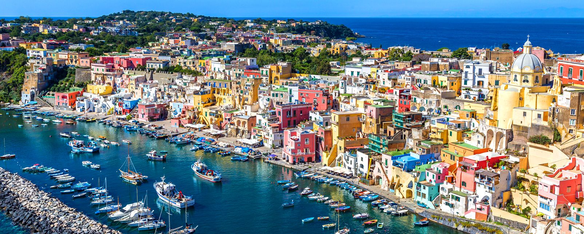
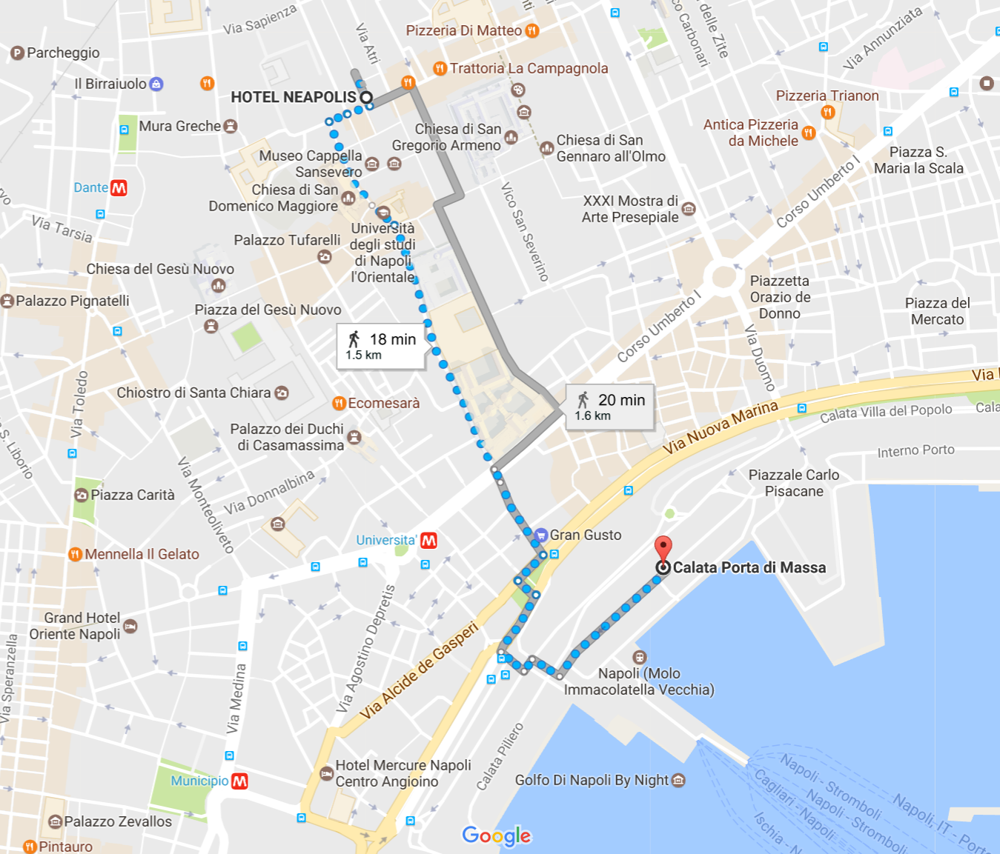
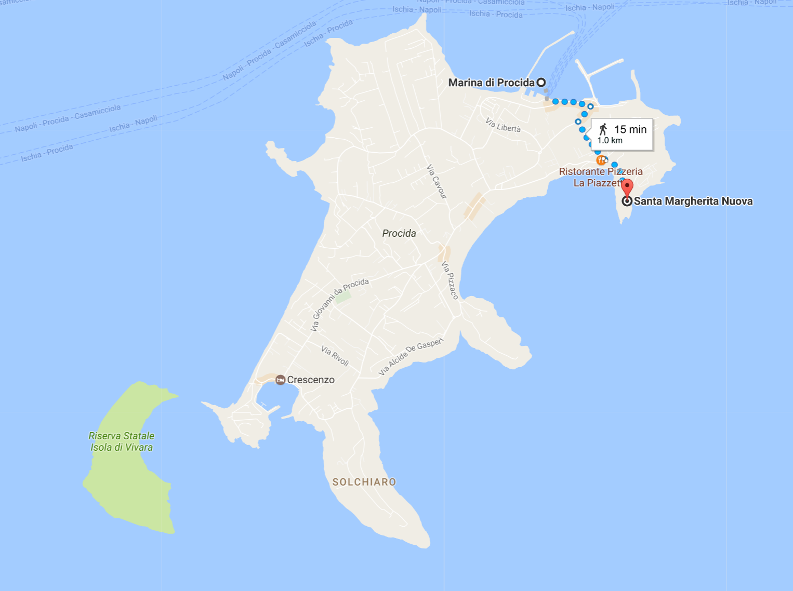

# EMBO Practical Course:

# Population Genomics: background and tools

<table style="width:100%">
   <tr>
     <td></td>
     <tr/>
</table>

<table style="width:100%">
 <tr>
   <td></td>
   <tr/>

</table>

## Twitter #EMBOpopgen

## Connections
WiFi and SSH instructions [here](WiFi-SSHinstruction.md)

## Timetable

#### Speakers schedule
- Andrés Aida 18-22 May
- Manica Andrea 18-26 May
- Clark Andrew 18-23 May
- Hellenthal Garrett 19-26 May
- Moltke Ida 18-24 May
- Sikora Martin 23-26 May
- Currat Mathias 18-26 May
- Delaneau Olivier 18-21 May
- Gerbault Pascale 18-24 May

#### All raw data and software are available on the INFN machine

Days |Lessons  | Tutorials |
------------ | ------------- | ------------- |
day 1 |[Opening Lecture](day1/EMBOClarkOverview.pdf) | |
day 2 |[Data QC and ExploratoryData Analysis I ](day2/olivier/morning_session_course.pdf)  - [Data QC and ExploratoryData Analysis II ](day2/olivier/afternoon_session_course.pdf)|[practical I](day2/olivier/morning_session_practical.pdf) -  [practical II](day2/olivier/afternoon_session_practical.pdf) -  [commands list I ](day2/olivier/morning_session_practical.sh)  -   [commands list II](day2/olivier/afternoon_session_practical.sh) |
day 3 |[Genetic Forces](day3/andyclark/EMBO-popgen-Forces-CLARK.pdf) - [Species divergence](day3/aida/EMBO_Napoli_May2017_lectureAidatoprint.pdf) |  [AlleleFreqDyn](day3/andyclark/AlleleFreqDyn.txt) - [InfiniteSites](day3/andyclark/InfiniteSites.txt) - [SampleData1](day3/andyclark/SampleData1.txt)  - [SampleData2](SampleData2.txt) -  [SampleData3](day3/andyclark/SampleData3.txt) - [WFsim](day3/andyclark/WFsim.txt)| - [ELS](day3/aida/Tutorial_ELS.txt) - [MK](day3/aida/Tutorial_MK.txt) |
day 4 |[Natural Selection](day4/pascale/2017.05.21EMBO_PG.pptx.pdf) - [GWAS](day4/andrea/2017EMBOManicaselection.pdf) |[Natural Selection tutorial](day4/pascale/20170521PascalePractical.sh) - [GWAS tutorial](day4/andrea/2017EMBOManicaonGWAS.pdf)|
day 5 ||[relatedeness exercises](http://popgen.dk/ida/EMBONaples2017/web/)|
day 6 |||
day 7 |||
day 8 |||
day 9 |||

## Group Projects

[Project 1](projects/project1.md)

## Day trip to Procida

<table style="width:100%">
   <tr>
     <td></td>
     <tr/>
</table>

### Shedule

- 9.00 meet in the hotel courtyard
- 10.45 boat to Procida
<table style="width:100%">
   <tr>
     <td></td>
     <tr/>
</table>

- 11.45 arrival at Procida and walk to Chiesa di Santa Margherita

<table style="width:100%">
   <tr>
     <td></td>
     <tr/>
</table>

- 12:30 lunch

- 1.30 Research Clinics
