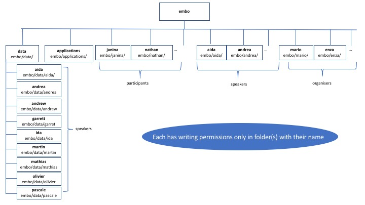

##  WiFi

network name: embo2017
password: popgen

##  SSH
For this course we will work on the High Performance Cluster of the [Istituto Nazionale di Fisica Nucleare](https://www.ba.infn.it/index.php/en/)

The filesystem has been generated according to this structure

To connect to the INFN machine using SSH from a Linux terminal use:

ssh yourusername@elixir-it-trein.recas.ba.infn.it

Use uername and password have been given to you at the reception

 #### thanks to Giacinto Donvito, Stefano Nicotri, Mario Aversano, Claudia Rallo
